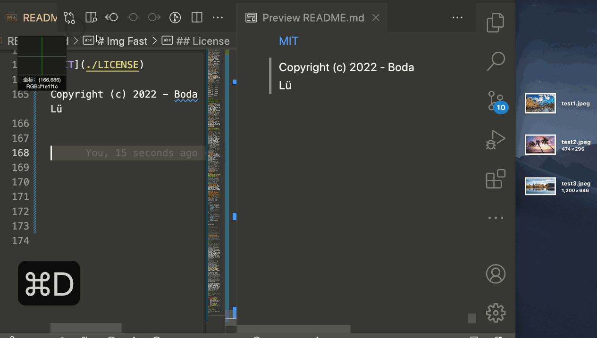

<div align="center">

[](https://github.com/lvboda/vscode-img-fast)

# Img Fast

[](https://github.com/lvboda/vscode-img-fast)  [](./LICENSE)  [](https://marketplace.visualstudio.com/items?itemName=lvboda.vscode-img-fast)  [](https://marketplace.visualstudio.com/items?itemName=lvboda.vscode-img-fast)

A vscode plugin that can quickly upload clipboard images and get image URL.

**English** **|** [**简体中文**](./README.zh-cn.md)

</div>



## Feature

- Supports windows/macOS.
- Supports screenshot paste upload.
- Supports single/multiple file paste upload.
- Supports single/multiple file deletion. (cloud deletion)
- Supports customize upload and delete shortcut keys.
- Supports with `multipart/form-data` formalized transmission interface, such as `smms/vgy.me`.

## Install

Search for `Img Fast` in the vscode extension marketplace and click install, or use the shortcut `ctrl + p` and type `ext install img-fast` in the input field.

## Usage

1. Fill in the Configuration Items, among which `authorization`, `uploadUrl`, `uploadMethod`, `uploadFormDataKey` must be set, otherwise cannot upload.

2. Taking a screenshot or copying an image file into a document will automatically call the interface set at `uploadUrl` to upload the file. (You can also customize the function shortcut keys, [view shortcut key for custom command](#ShortcutKeyForCustomCommand))

## <span id="Configuration">Configuration</span>

- **openPasteAutoUpload**: Whether to enable automatic uploading of pasted images. (enabled by default)
- **openDeleteHover**: Whether to enable the deletion hover window. (enabled by default)
- **authorization**: `Authorization` of the request header
- **imgRename**: Rename image before uploading, [view All parameters](#NamedParameter).
- **outputRename**: Customize the paste format after the images is uploaded, [view All parameters](#NamedParameter).
- **uploadUrl**: Upload api.
- **uploadMethod**: Upload request method.
    - GET
    - POST
    - PUT
    - PATCH
    - DELETE
- **uploadFormDataKey**: `formData` key, it's usually `file` or `img`.
- **uploadedKey**: Key of the image url of the response body of the upload. (if it is empty, it matches the first url)
- **deleteUrl**: Delete api. (Disable synchronous deletion if the value is empty)
- **deleteMethod**: Delete request method.
    - GET
    - POST
    - PUT
    - PATCH
    - DELETE
- **deleteQueryKey**: The key of the delete api query parameter.
  - If the configuration is not empty, the url is: `${deleteUrl}?${deleteQueryKey}=${image name}` , For details about image name matching rules, [see the command execution flow](#img-fast.delete).
  - If the configuration is empty, the url is: `${deleteUrl}/${image name}`.
- **img-fast.deletedFlag**: Operations after a successful delete api call.
    - **none**: Do nothing.
    - **url**: Delete the corresponding image URL from the document.
    - **layout**: Delete the corresponding image layout from the document, `` or ``.

### <span id="NamedParameter">Named Parameter</span>
| key  | value | explain |
|---|---|---|
| `hash` | ebf1649c4a5e29e7efa2dd0db8d191a... | The md5 value of the file, 32 bits. |
| `basename` | screenshot.png | Original name of image. (has suffix) |
| `name` | screenshot | Original name of image. (no suffix) |
| `format` | png | Image suffix. |
| `path` |  /Users/xx/Desktop/screenshot.png | Image storage path. |
| `url` | https:/xx.xxx.com/xx/screenshot.png | Image URL after upload. (empty before upload) |
| `beforeUploadPath` | /Users/xx/Desktop/2022-11-31-screenshot.png | The storage path before the image is uploaded. |
| `beforeUploadName` | 2022-11-31-screenshot.png | The name before the image is uploaded. |
| `timestamp` | 1669721343072 | Current timestamp. |
| `yyyy` | 2022 | Current year. |
| `MM` | 11 | Current month. |
| `dd` | 31 | Current date. |
| `hh` | 12 | Current hour. |
| `mm` | 00 | Current minute. |
| `ss` | 00 | Current second. |
| `S` | 737 | Current millisecond. |
| `q` | 4 | Current quarter. |

## Command

### Command Execution Flow

#### img-fast.upload

1. Determine the `uploadUrl` configuration and terminate the command if it is empty.
2. Gets all images of the current clipboard.
3. Images temporary directory named according to the `imgRename` configuration and stored in the plugin directory.
4. Call the upload interface configured for `uploadUrl` to upload images.
5. The json data of the response body is matched according to the `uploadedKey` configuration after the call is successful.
6. Output the URL to the document according to the `outputRename` configuration.

#### <span id="img-fast.delete">img-fast.delete</span>

1. Determine the `deleteUrl` configuration and terminate the command if it is empty.
2. If any text is selected, the image name of all urls in the selected text is matched. If no text is selected, the image name of the first URL of the text in the line of the current cursor is matched.
   -  URL if it is http:/lvboda.cn/screenshot.png then match screenshot.png.
   -  URL if it is http:/lvboda.cn/screenshot then match screenshot.
3. Start URL concatenation by configuring `deleteQueryKey` and `deleteUrl`, for details about the concatenation rules, [see configuration](#Configuration).
4. Invoke the concatenated URL for deletion.
5. After the call is successful, if any text is selected, the selected text is deleted. If no text is selected, the subsequent operations are performed according to the `deletedFlag` configuration, [see the configuration](#Configuration) for `deletedFlag`.

### <span id="ShortcutKeyForCustomCommand">Shortcut Key For Custom Command</span>

By default, this plugin enables the automatic uploading of paste images and clicking on the link suspended in the URL for deletion. It's core function is to call `img-fast.upload` and `img-fast.delete` these two commands, so you can complete the function with the form of custom shortcut key call command.

Click `Code -> Preferences -> Keyboard Shortcuts -> Open Keyboard Shortcuts (json)` or use the shortcut `ctrl + shift + p -> type keyboard` to enter keybindings.json file, add the following configuration to the array of json files, replace `key` with the shortcut key you want to set.

```json
{
    "key": "ctrl+alt+p",
    "command": "img-fast.upload",
    "when": "editorTextFocus",
},
{
    "key": "ctrl+alt+d",
    "command": "img-fast.delete",
    "when": "editorTextFocus",
}
```

Add and save.

> Because the implementation of the default function is to monitor the change of the text to control the execution of the command, so there may be some unpredictable problems, more recommended the form of custom keys. Set `openPasteAutoUpload` to false after customizing the key to turn off the default function and avoid causing unnecessary conflicts.

## Other

Because the API of other image beds may not be compatible with this plugin, such as using github as an image bed, the images are transmitted in the form of strings through base64 encoding, as a lightweight plugin, there is no way to adapt to all image beds. (We will consider adapting other image beds in the form of configuration js files in the future)

Therefore, it is recommended to use a custom figure bed. I provide a suitable configuration plugin upload and delete service. You can use it by [download](https://github.com/lvboda/file-upload-server/releases) it directly. You only need to prepare a server.

If the upload takes a long time due to the network or other reasons, you can continue to write the document. After the upload is successful, it will be inserted at the position of the cursor before uploading, and the subsequent text will not be overwritten.

For vscode loading speed, this plugin will only be activated in markdown documents. If you want to use the plugin in other types of files, please open a `.md` file to activate before use.

## Sponsor

If this plugin is helpful to you, welcome to sponsor ~

<div align="center">
    
    &nbsp;&nbsp;&nbsp;&nbsp;
    
</div>

## License

[MIT](./LICENSE)

Copyright (c) 2022 - Boda Lü
